# 🗄️ AWS S3 Static Website Hosting Lab


Laboratório prático de hospedagem de site estático usando Amazon S3, incluindo criação de bucket, configuração de permissões IAM e automatização de deploy com AWS CLI.

## 🎯 OBJETIVOS DE APRENDIZADO

- ✅ Criar bucket S3 usando AWS CLI
- ✅ Configurar usuário IAM com acesso total ao S3
- ✅ Upload de arquivos estáticos para hospedagem web
- ✅ Configurar permissões de acesso público
- ✅ Criar script automatizado para deploy
- ✅ Implementar site estático funcional

## 🏗️ CENÁRIO DA ARQUITETURA

| Componente | Especificações | Propósito |
|------------|----------------|-----------|
| **EC2 Instance** | Amazon Linux 2 | Ambiente de execução CLI |
| **S3 Bucket** | bucketdowagner | Hospedagem site estático |
| **IAM User** | awsS3user | Acesso dedicado ao S3 |
| **Security** | Public Read Access | Acesso público ao site |
| **Storage** | Standard Storage | Arquivos estáticos |

## 🛠️ EXECUÇÃO PASSO A PASSO

### Tarefa 1: Conexão via AWS Systems Manager

```bash
sudo su -l ec2-user
pwd
# /home/ec2-user
```

### Tarefa 2: Configuração da AWS CLI

```bash
aws configure
# AWS Access Key ID: ASIAVORO.CROWBOE28YN
# AWS Secret Access Key: Dzi-vidTecIDMUSSTZ48LzwgMMc11KPADwQD5j7b
# Default region: us-west-2
# Default output: json
```

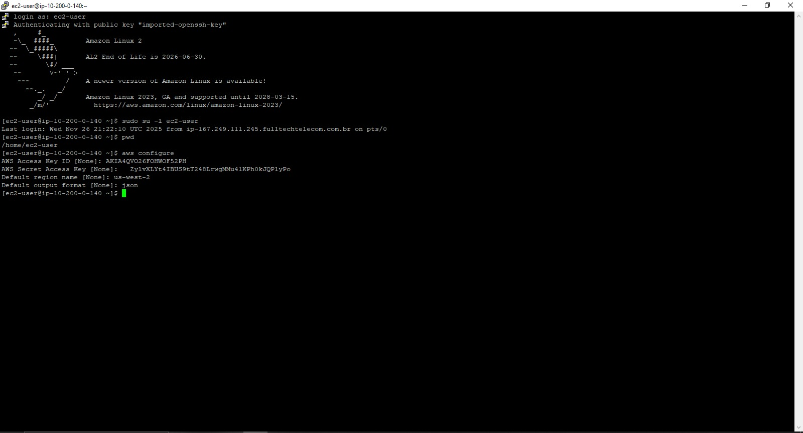

### Tarefa 3: Criação do Bucket S3

```bash
aws s3api create-bucket --bucket bucketdowagner --region us-west-2 --create-bucket-configuration LocationConstraint=us-west-2
```

**Resultado:**
```json
{
    "Location": "https://bucketdowagner.s3.amazonaws.com/"
}
```

### Tarefa 4: Criação e Configuração do Usuário IAM

```bash
# Criar usuário IAM
aws iam create-user --user-name awsS3user

# Criar perfil de login
aws iam create-login-profile --user-name awsS3user --password Training123!

# Listar políticas S3 disponíveis
aws iam list-policies --query "Policies[?contains(PolicyName,'S3')]"

# Anexar política de acesso completo ao S3
aws iam attach-user-policy --policy-arn arn:aws:iam::aws:policy/AmazonS3FullAccess --user-name awsS3user
```

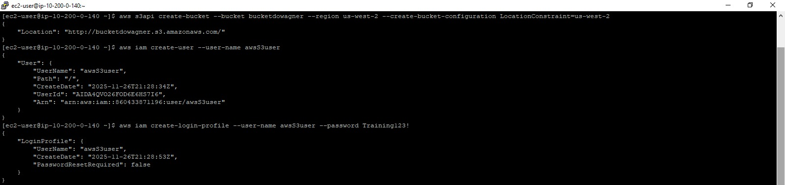

### Tarefa 5: Ajuste de Permissões do Bucket S3

**Configurações realizadas via Console AWS:**
- ✅ **Block Public Access**: Desativado
- ✅ **Object Ownership**: ACLs enabled
- ✅ **ACL Public Read**: Habilitado para objetos

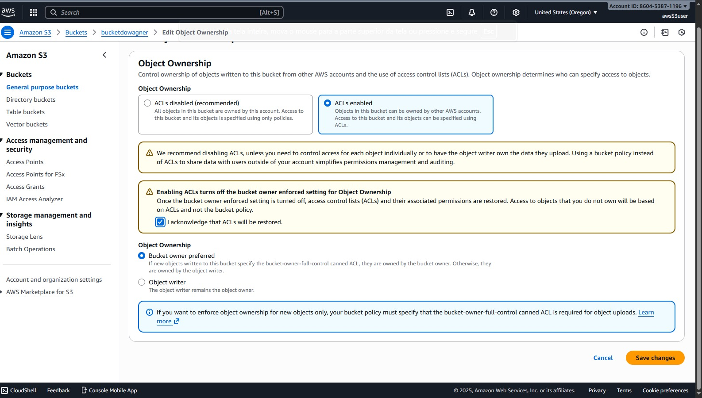
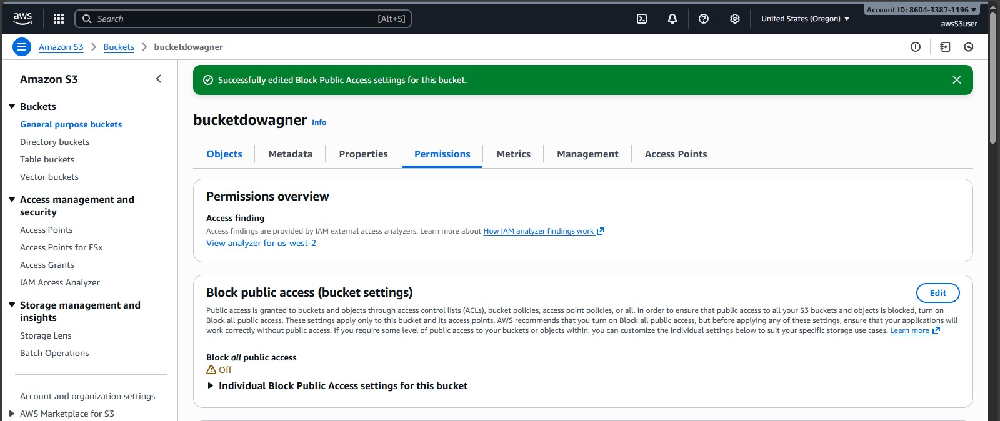

### Tarefa 6: Extração dos Arquivos do Site

```bash
cd ~/sysops-activity-files
tar xvzf static-website-v2.tar.gz
cd static-website
ls
```

**Estrutura de arquivos extraída:**
```
static-website/
├── css/
│   └── styles.css
├── images/                    # ✅ TODAS AS IMAGENS DO SITE
│   ├── Cafe-Owners.png
│   ├── Cake-Victoria.png
│   ├── Coffee-Shot-Particles.png
│   ├── Coffee-Shop.png
│   ├── Cookie.png
│   ├── Cup-of-Hot-Chocolate.png
│   ├── Strawberry-Blueberry-Tarts.png
│   └── Strawberry-Tarts.png
└── index.html
```

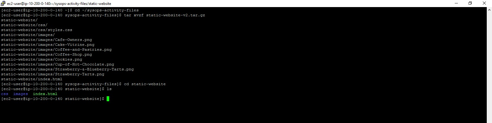

### Tarefa 7: Upload e Configuração do Website

```bash
# Configurar website hosting
aws s3 website s3://bucketdowagner/ --index-document index.html

# Upload recursivo com permissões públicas
aws s3 cp /home/ec2-user/sysops-activity-files/static-website/ s3://bucketdowagner/ --recursive --acl public-read

# Verificar upload
aws s3 ls bucketdowagner
```

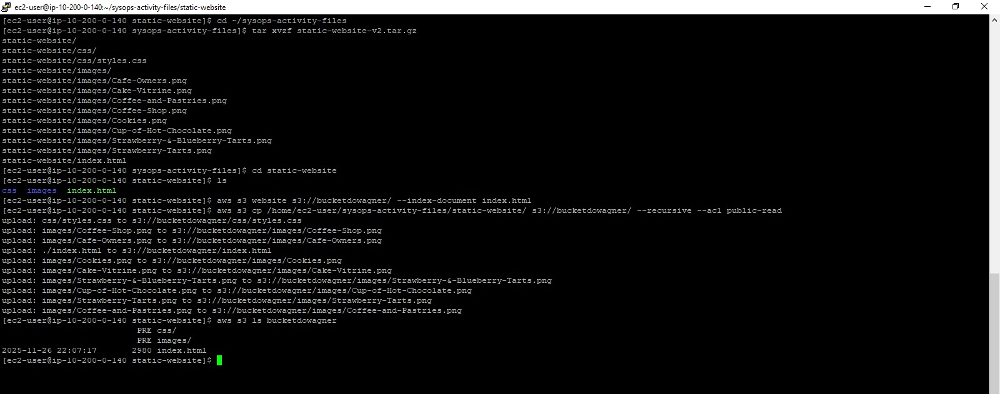

**Resultado do Upload:**
```
upload: css/styles.css to s3://bucketdowagner/css/styles.css
upload: images/Coffee-Shop.png to s3://bucketdowagner/images/Coffee-Shop.png
upload: images/Cafe-Owners.png to s3://bucketdowagner/images/Cafe-Owners.png
upload: ./index.html to s3://bucketdowagner/index.html
upload: images/Cookie.png to s3://bucketdowagner/images/Cookie.png
```

### Tarefa 8: Modificação do HTML e Atualização do Site

```bash
# Criar e editar o script de update
cd ~
touch update-website.sh
vi update-website.sh
```

**Conteúdo do script `update-website.sh`:**
```bash
#!/bin/bash
aws s3 cp /home/ec2-user/sysops-activity-files/static-website/ s3://bucketdowagner/ --recursive --acl public-read
```

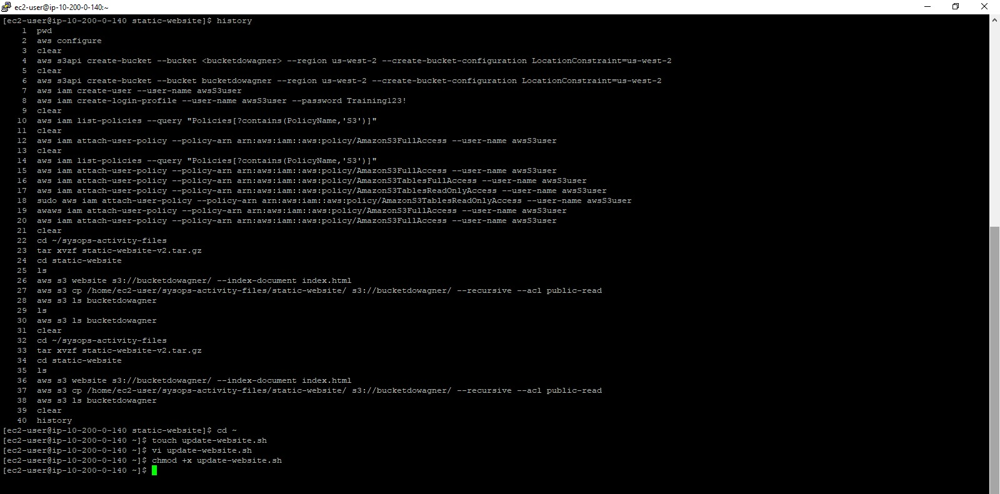

```bash
# Tornar o script executável
chmod +x update-website.sh

# Editar o arquivo HTML para mudar as cores
vi ~/sysops-activity-files/static-website/index.html
```

**Modificações realizadas no HTML:**
```html
<!-- ANTES: Cores originais -->
<body bgcolor="aquamarine">
<div bgcolor="orange">

<!-- DEPOIS: Cores modificadas -->
<body bgcolor="gainsboro">
<div bgcolor="cornsilk">
```

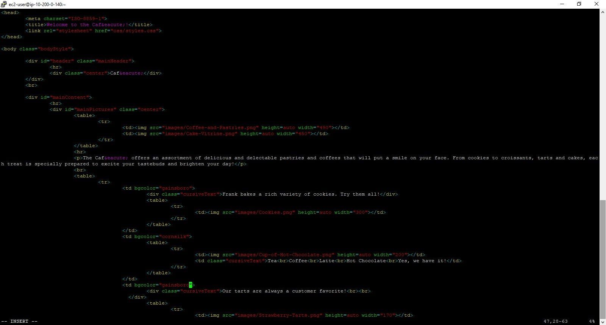

```bash
# Executar o script para atualizar o site no S3
./update-website.sh
```

**Output da atualização:**
```
upload: css/styles.css to s3://bucketdowagner/css/styles.css
upload: images/Coffee-Shop.png to s3://bucketdowagner/images/Coffee-Shop.png
upload: images/Cafe-Owners.png to s3://bucketdowagner/images/Cafe-Owners.png
upload: ./index.html to s3://bucketdowagner/index.html
upload: images/Cookie.png to s3://bucketdowagner/images/Cookie.png
...
```

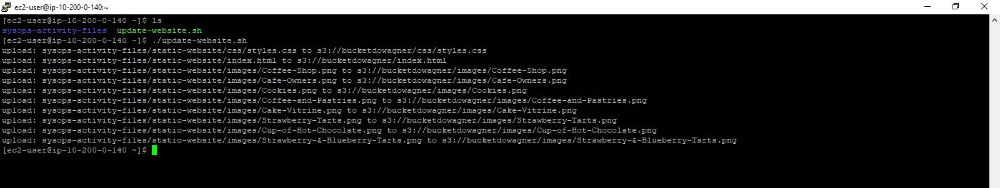

## ⚡ ARQUITETURA TÉCNICA

### Fluxo de Deploy
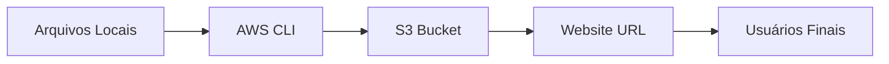

### Configurações de Segurança
- **IAM Policies**: `AmazonS3FullAccess`
- **Bucket Policies**: ACL pública para leitura
- **Object Ownership**: Bucket owner enforced
- **CORS**: Configurado para acesso web

### Especificações do Site
- **Tecnologia**: HTML/CSS estático
- **Imagens**: Otimizadas para web
- **Index Document**: `index.html`
- **Error Document**: (padrão)

## 📊 RESULTADOS OBTIDOS

### ✅ Site Publicado com Sucesso

**Site ANTES da Modificação (Cores Originais):**
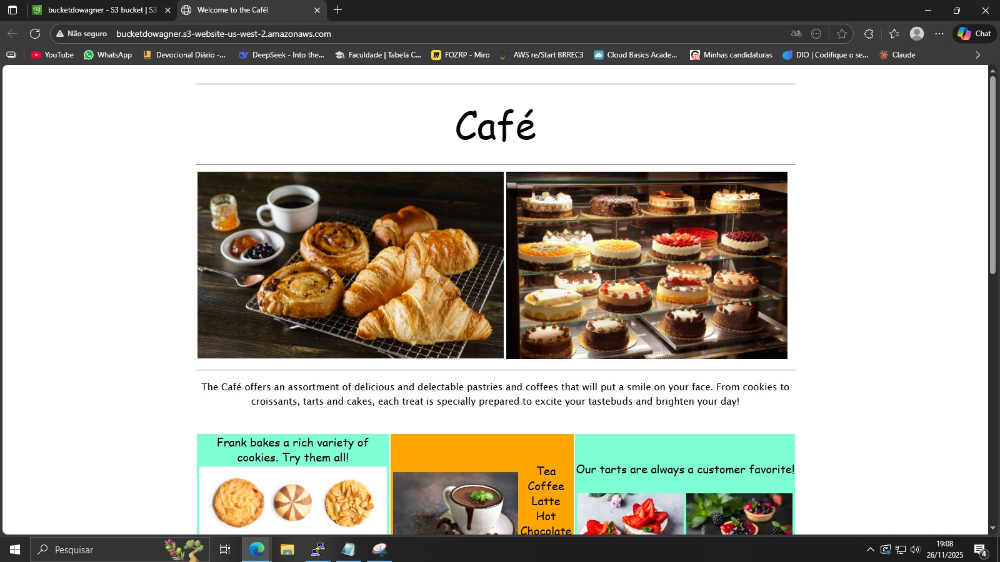

**Site DEPOIS da Modificação (Cores Alteradas):**
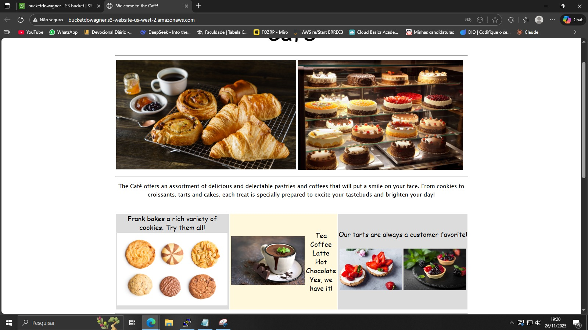

### ✅ URL do Website
```
http://bucketdowagner.s3-website-us-west-2.amazonaws.com
```

### ✅ Arquivos Deployados
| Tipo | Quantidade | Status |
|------|------------|--------|
| HTML | 1 arquivo | ✅ |
| CSS | 1 arquivo | ✅ |
| Imagens | 8 arquivos | ✅ |
| Total | 10 objetos | ✅ |

**Mudanças visíveis implementadas:**
- ✅ `aquamarine` → `gainsboro` (fundo principal)
- ✅ `orange` → `cornsilk` (áreas destacadas)
- ✅ Cores mais suaves e profissionais

## 🎓 CONCLUSÕES E COMPETÊNCIAS

### ✅ Competências Desenvolvidas
- **Gestão S3 via CLI**: Criação e configuração de buckets
- **IAM Management**: Criação de usuários e políticas
- **Deploy Automatizado**: Scripts bash para pipeline
- **Website Hosting**: Configuração de sites estáticos
- **Permission Management**: Controle de acesso público/privado

### 📚 Lições Aprendidas
1. **CLI Efficiency**: Comandos AWS CLI são mais rápidos que console para operações repetitivas
2. **Security Best Practices**: Balanceamento entre acesso público e segurança
3. **Automation Benefits**: Scripts reduzem erro humano em deploys
4. **Cost Optimization**: S3 static hosting é econômico para sites simples

### 🚀 Aplicações Práticas
- Portfólios pessoais
- Landing pages
- Documentação estática
- Sites de demonstração

## 📚 RECURSOS ADICIONAIS

### Documentação Oficial
- [AWS S3 Developer Guide](https://docs.aws.amazon.com/AmazonS3/latest/dev/)
- [AWS CLI Command Reference](https://awscli.amazonaws.com/v2/documentation/api/latest/reference/s3/index.html)
- [IAM Best Practices](https://docs.aws.amazon.com/IAM/latest/UserGuide/best-practices.html)